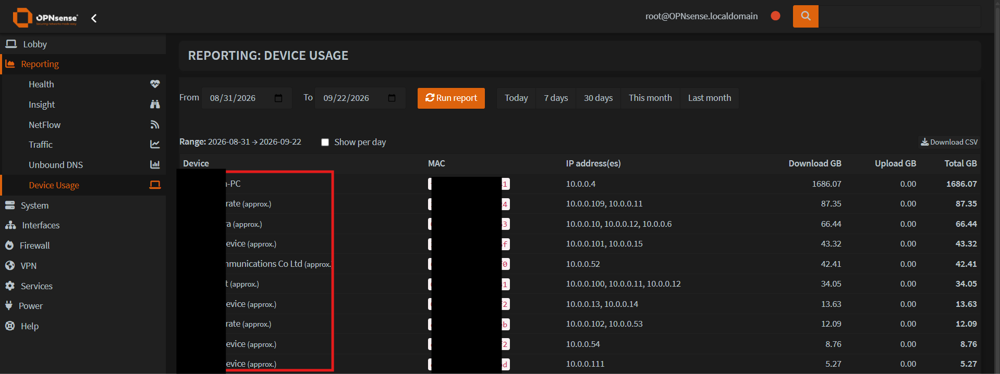

# os-usagereport: per-device internet usage for OPNsense

Vibe coded OPNsense plugin that adds **Reporting > Device Usage**: how much internet each device
(MAC address) downloaded and uploaded between two dates, with per-day breakdown and CSV export.

It does not capture anything itself. It reads the NetFlow data that **Reporting > Insight**
already stores and maps IP addresses to devices using Kea DHCP reservations and leases,
Hostwatch history and a daily IP-to-device snapshot recorded by cron.



The same report from the shell:

```
Device                       MAC                 Download GB  Upload GB   Total GB  IPs
----------------------------------------------------------------------------------------------------
desktop-pc                   aa:bb:cc:dd:ee:01        248.46       3.10     251.56  192.168.1.10
laptop                       aa:bb:cc:dd:ee:02         25.75       0.92      26.67  192.168.1.57
Intel Corporate *            aa:bb:cc:dd:ee:03         20.42       0.61      21.03  192.168.1.61
...
All devices                                           326.60       4.41     331.01
WAN (pppoe0) cross-check                              326.47       4.40     330.87
```

## Layout

The repository follows the [opnsense/plugins](https://github.com/opnsense/plugins) convention so
it can be dropped into that tree as `net/usagereport` or submitted upstream.

```
net/usagereport/
  Makefile                                   plugin metadata (name, version, maintainer)
  pkg-descr                                  description shown in System > Firmware > Plugins
  src/bin/usage-report                       shell wrapper: `usage-report --last 7`
  src/etc/inc/plugins.inc.d/usagereport.inc  registers the 23:55 daily snapshot cron job
  src/opnsense/scripts/usagereport/usage-report.py   the report engine (CLI, CSV, JSON, snapshot)
  src/opnsense/service/conf/actions.d/actions_usagereport.conf   configd actions "usagereport report|snapshot"
  src/opnsense/mvc/app/controllers/OPNsense/UsageReport/          page + API controllers
  src/opnsense/mvc/app/models/OPNsense/UsageReport/{Menu,ACL}/   menu entry and privilege
  src/opnsense/mvc/app/views/OPNsense/UsageReport/index.volt      the page
```

## Requirements

- OPNsense 26.x (tested on 26.7.4). Python 3 and sqlite3 ship with the base system.
- **Reporting > NetFlow** with *Capture local* (Insight) enabled and the LAN interface selected.
  For upload accounting on a bridged LAN also select the bridge **member** interfaces; the
  capture hooks into the physical port a frame arrives on, so the bridge alone only sees downloads.
- Kea DHCPv4 for hostname/reservation lookups (ISC static mappings are not read). Hostwatch
  (Interfaces > Neighbors) improves attribution of dynamic addresses.

## Build and install

On an OPNsense box (or any FreeBSD with the plugins tree):

```sh
pkg install -y git
git clone https://github.com/opnsense/plugins /usr/plugins
git clone <this repo> /usr/plugins/net/usagereport-src && cp -R /usr/plugins/net/usagereport-src/net/usagereport /usr/plugins/net/
cd /usr/plugins/net/usagereport
make package            # -> work/pkg/os-usagereport-1.0.pkg
pkg add work/pkg/os-usagereport-1.0.pkg
```

The plugin then shows up under System > Firmware > Plugins and the page under Reporting.
`make lint` and `make style` run the upstream syntax and style checks.

## Usage

- Web UI: **Reporting > Device Usage**. Pick dates or a quick range, tick *Show per day*, *Download CSV*.
- Shell: `usage-report --last 30`, `usage-report --from 2026-09-01 --to 2026-09-30 --by-day`, `--csv`, `--json`.
- Non-default interface names: `usage-report --lan opt1 --wan opt2 ...` (config names, not device names).

## How the numbers are produced

| Column | Source | Filter |
|---|---|---|
| Download | Insight details, `if` = LAN device, direction `out`, `src_addr` = client | destination not in LAN, not broadcast/multicast |
| Upload | Insight details, `if` in LAN device + bridge members, direction `in`, `src_addr` = client | same |
| WAN cross-check | Insight totals for the WAN device | none |

Insight keeps the details table for about 62 days; older days fall back to the per-address totals
table, which cannot exclude LAN-to-LAN traffic. Days are UTC days, as stored by Insight.

Device identity per (day, IP) is resolved in this order: daily snapshot, Kea reservation,
Hostwatch current/previous MAC, Kea lease, ARP. Names come from the reservation hostname or
description, the lease hostname, the snapshot, or the MAC vendor. Devices with randomized
(private) Wi-Fi MAC addresses appear as "unknown device" unless given a reservation.

## License

BSD 2-Clause, see LICENSE.
